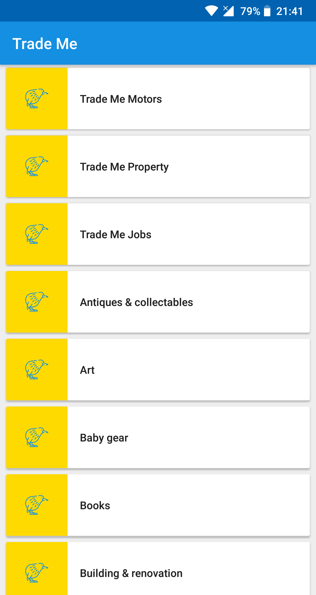

# Trade Me App #

The Trade Me application allows users to browse categories and listings found in Trade Me. 

# Screenshots

Phone Screenshots

   
   
   

Tablet Screenshots

   
   

# What does this app do?
It is an open source Android application that allows users to browse categories and listings found in the Trade Me Sandbox environment. The application supports both mobile phones and tablets.

# Libraries used:

1. OkHttp - https://github.com/square/okhttp
2. Retrofit - https://github.com/square/retrofit
3. Dagger - https://github.com/google/dagger 
4. ButterKnife - https://github.com/JakeWharton/butterknife
5. Gson - https://github.com/google/gson
6. Picasso - https://github.com/square/picasso
7. Android Image Slider - https://github.com/daimajia/AndroidImageSlider

# Setup

1. Navigate to [repo](https://github.com/emilany/Trade-Me)
2. Clone locally using
   `git clone https://github.com/emilany/Trade-Me.git`
3. Run app via ide
4. Enjoy!
